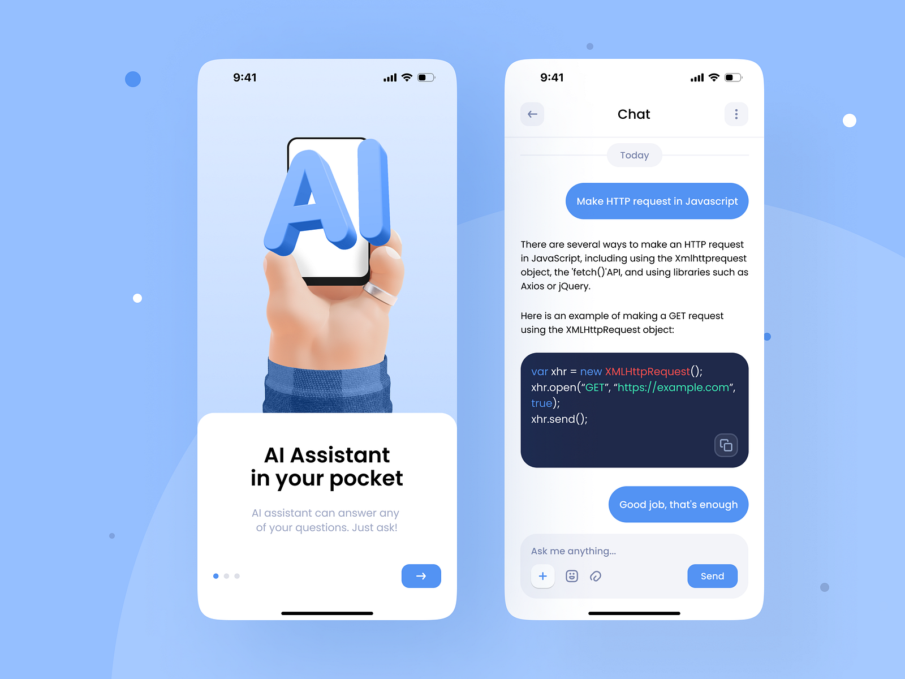

# 🤖 AI Assistance




## ✨ App Overview

**AI Assistance** is a Flutter-based application that allows users to have real-time conversations with an AI, powered by the Gemini API. The app provides an intuitive, beautiful, and simple UI, ensuring a seamless experience as users send messages and receive AI-generated responses. All chat history is saved locally on the device using the SharedPreferences package, so users can revisit previous chats anytime.

## 🚀 Features

- 💬 **Real-time Chat**: Engage in conversation with an AI.
- 🤖 **Gemini API Integration**: Powered by Google Generative AI for smart responses.
- 💾 **Local Storage**: Chat history is saved locally using SharedPreferences, so it's always accessible.
- 🎨 **Simple and Beautiful UI**: A clean design focused on usability and simplicity.

## 🛠️ Technologies Used

- 🧩 **Flutter**: The framework used to build the app.
- 🔨 **Dart**: The programming language used in the app.
- 💼 **SharedPreferences**: Used for local data storage (chat history).
- 🧠 **Gemini API**: Provides AI-generated responses.

## 📦 Getting Started

### ✅ Prerequisites

- 📦 Flutter SDK
- 🛠️ Dart SDK
- 🔑 Access to the Gemini API

### 📲 Installation

1. Clone the repository:
    ```bash
    git clone https://github.com/your-username/AI-Assistance-App.git
    ```
2. Navigate to the project directory:
    ```bash
    cd AI-Assistance-App
    ```
3. Install dependencies:
    ```bash
    flutter pub get
    ```
4. Run the app:
    ```bash
    flutter run
    ```

## 🤝 Contributing

Contributions are welcome! Please submit a pull request or open an issue to discuss potential changes.

## 📄 License

This project is licensed under the MIT License - see the [LICENSE](LICENSE) file for details.

## 📧 Contact
For any questions or feedback, feel free to reach out to me on [LinkedIn](https://linktr.ee/DineIssam).
